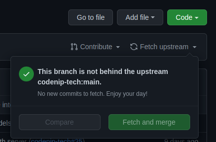

# Brisbane

Collaborative project for Codenip's weekly streaming. Every Wednesday from 20:00 on https://twitch.tv/codenip_devs

## Content
- OAuth server (Symfony 5.4 + MariaDB + Nginx)
- Main Application (Symfony 5.4 + MariaDB + Nginx)

## Contributing
To contribute to this project there are some basic rules:
- Check issues in https://github.com/codenip-tech/brisbane/issues
- If you want to work on one of them, please write a comment in the issue asking to work on it
- Update your fork main branch (you can do it by clicking in `Fetch upstream` button in the UI)

- Create a branch with a meaningful name. For example, if the task number is 30 and the task is to add a Product entity, then it should be something like `feature/30-add-product-entity`
- Once you do it, create a Pull Request!